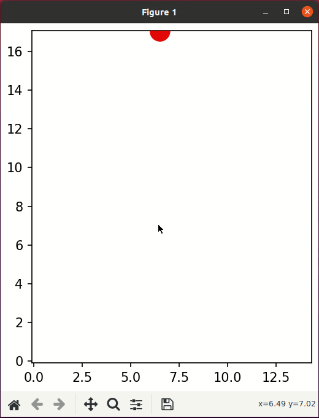

# Game Demo


# If you cannot enter docker
First open the terminal and type
```
$ sudo groupadd -f docker
```
Then type the following usermod command to add the active user to the **docker** group
```
$ sudo usermod -aG docker $USER #replace with your own username
```
Apply the group changes to the current terminal session by typing
```
$ newgrp docker
```
Finally check if the **docker** group is in the list of user groups
```
$ groups
```

# How to run the game
First we have to enter docker
```
$ source Docker/docker_run.sh
```
After you enter docker
```
# source require.sh
# python3 suika.py
```
